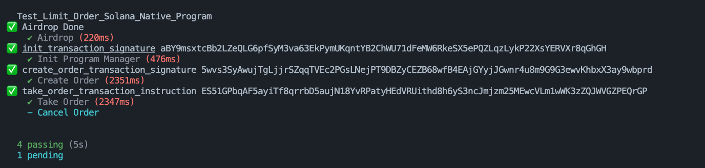
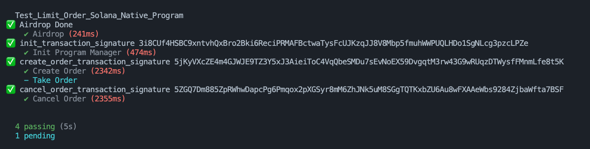

# Solana Limit Order Program

This is a Solana program written in native Rust that allows users to create and execute limit orders for token trades. The program includes functionality for initializing an admin-controlled vault, creating orders, taking orders, and canceling orders.

## Features

1. **Init**: Initializes the admin config account, which manages all vaults storing user funds.
2. **Create Order**: Users can create a limit order by specifying the token amount and price. The funds are transferred to a vault, and the order is stored off-chain.
3. **Take Order**: Another user accepts an existing order, triggering a token exchange. The taker receives tokens from the vault and sends funds to the order creator. The order book is updated accordingly.
4. **Cancel Order**: The order creator can cancel their order, retrieving their funds and removing the order from the order book.

## Installation and Setup

### 1. Clone the repository

```sh
git clone https://github.com/AhzamAkhtar/limit-order-native
```

### 2. Install dependencies to tests

Ensure you have Node.js and npm installed, then run:

```sh
npm install
```

### 3. Build and deploy the program

```sh
cargo build-sbf --manifest-path=Cargo.toml   
solana program deploy ./target/deploy/limit_order.so
```

### 4. Start a local Solana validator

```sh
solana-test-validator
```

### 5. Run tests

```sh
npm run test
```
## Tests Output





## Contributing

Feel free to open issues and submit pull requests to improve the program.


